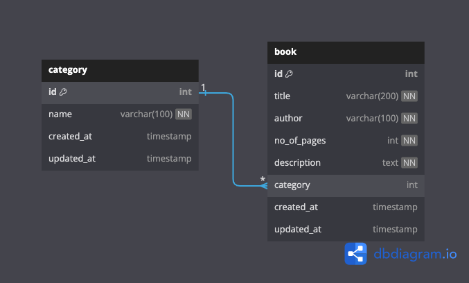

# Django Library API

Welcome to the Django Library API! This project provides a RESTful API for managing categories and books in a Library.

## Table of Contents

- [About](#about)
- [Features](#features)
- [Installation](#installation)
- [Usage](#usage)
- [Endpoints](#endpoints)


**For the complete API documentation, please click this [full documentation](https://documenter.getpostman.com/view/28578777/2sA3BuV8Fp).**

## Entity Relationship Diagram


## About

The Django Library API is built using Django and Django REST Framework. It allows users to perform CRUD (Create, Read, Update, Delete) operations on categories and books.

## Features

- Create, read, update, and delete categories
- Create, read, update, and delete books
- Associate books with categories
- Retrieve books by category

## Endpoints

### Categories:
- **List/Create:** `/api/categories/`
- **Retrieve/Update/Delete:** `/api/categories/<category_id>/`

### Books:
- **List/Create:** `/api/books/`
- **Retrieve/Update/Delete:** `/api/books/<book_id>/`


## Installation

1. **Clone the repository:**
   ```sh
   git clone https://github.com/Nathan-Yinka/Library-API.git
   ```
2. **Navigate to the project directory:**
    ```sh
    cd Library-API
    ```
3. **Create a virtual environment (optional but recommended):**
    ```sh
    python3 -m venv venv
    ```
4. **Activate the virtual environment:**
    -  on windows
        ```sh
            .\venv\Scripts\activate
        ```
    -  on macOS or Linux
        ```sh
            source venv/bin/activate
        ```
5. **Install dependencies:**
    ```sh
    pip install -r requirements.txt
    ```

6. **Apply database migrations:**
    ```sh
    python manage.py migrate
    ```

## Usage
1. **Run the development server:**
    ```sh
    python manage.py runserver
    ```
2.  Open your web browser and go to http://localhost:8000 to view the API documentation (provided by Django REST Framework's browsable API).
